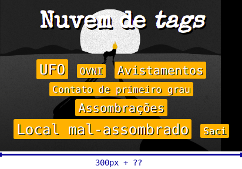
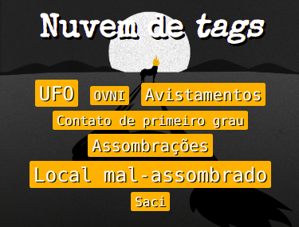
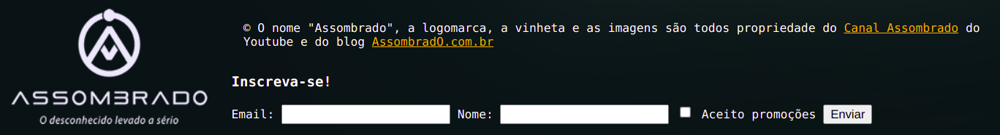

# Blog Assombrado 👻

Um blog sobre o desconhecido.


## Atividade

Você deve fazer algumas partes que faltam do blog assombrado.


## Exercício 0: encurtar a duração do vídeo

Abra a página no navegador. Assista uma vinheta bem legal. Faça isso duas vezes,
e tudo ainda estará bem. A partir da terceira, aguardar os 11s do vídeo
terminar passa a ser a pior coisa do mundo.

Portanto, veja no [FAQ](#faq) como fazer o vídeo desaparecer mais rapidamente.


## Exercício 1: _tags_ semânticas

Converta as `<div>` e `<span>` nas _tags_ semânticas mais adequadas,
**se houver**.

- **Pode ser que não exista uma _tag_ semântica** em alguns casos - aí
  continua sendo `<div>` ou `<span>` mesmo
- Veja as [_tags_ semânticas nos slides][tags-semanticas]

**Atenção**: ao alterar o HTML (mudar uma tag para outra, mudar ou tirar
uma `class` ou um `id`), deve-se verificar se são necessárias alterações nos
arquivos CSS e em códigos JavaScript.

Por exemplo, se você tirar o `id` da `<div id="cabecalho">...</div>`,
faça uma busca por `#cabecalho` no arquivo CSS para verificar se precisa alterá-lo
de forma que os estilos continuem se aplicando mesmo depois da alteração.


## Exercício 2: menu horizontal

Torne horizontal a lista com o menu principal. Faça de forma que o menu
fique semelhante ao da imagem final (lá em cima). Veja como
[transformar uma lista não ordenada em uma lista horizontal][lista-horizontal].

Você vai precisar usar a propriedade `display`.
[Veja como nos slides][propriedade-display].


## Exercício 3: tamanho da seção de _tags_

Para treinar o conceito de _box model_ ([slides][slides-box-model]),
você deve corrigir o fato do elemento que contém as _tags_ estar
maior do que deveria. No total, deveria ser `300px` de largura, mas
ele ficou com mais e, como efeito indesejado, uma "coluna preta" apareceu à direita (a imagem de fundo terminou e não repete).

Consulte o _box model_ do elemento `#tags` e proponha uma alteração
em seu CSS que o corrija, sem alterar nada sobre a imagem de fundo.





## Exercício 4: Formulário de "Inscreva-se!"

No rodapé, dentro de `#inscreva-se`, crie elementos HTML simulando um
formulário de inscrição. Deve ter um título (`h3`) "Inscreva-se!", além
de campos de entrada com seus rótulos:

1. Campo (e rótulo) para "Nome"
1. Idem para "E-mail"
1. Idem para "Aceito receber promoções" (✅)
1. Botão "Inscrever" (que não fará nada)



Lembre-se dos [elementos de entrada e botões][entrada-e-botoes] nos slides.


## Exercício 5: _tags_ parecendo botões

Estilize as _tags_ que ficam na nuvem de _tags_ (elemento `#tags`) de
forma que, ao serem clicadas¹, elas sejam **deslocadas** `2px` para
cima e `2px` para a esquerda da posição onde elas estão
originalmente posicionadas.

- Veja [os valores para a propriedade `position`][propriedade-position]
  para decidir se neste caso deve ser usado `static`, `relative`, `absolute`
  ou `fixed`.


Além de alterar a posição das _tags_ quando clicadas, altere também o
cursor do mouse. Veja [como alterar o cursor no FAQ](#faq).

### ¹: "ao serem clicadas"

Podemos usar a pseudo-classe `:active` para estilizar elementos no
momento em que estão sendo clicados. Você já usou isso para estilizar
_links_ da seguinte forma:

```css
a:link {
}

a:visited {
}

a:hover {
}

a:active {
  /* se aplica aos <a>...</a> quando estão sendo clicados */
}
```

Repare que **é possível usar `:active`** não apenas nas _tags_
`<a>...</a>` (de hiperlinks), mas **em qualquer elemento**.


## Exercício 6: "Novidade!"

Usando **pseudo-elementos** ([slides][pseudo-coisas]), faça com que toda
postagem que possui a classe `.novidade` tenha o texto "Novidade!"
imediatamente antes do seu conteúdo (como na imagem lá em cima). Use
sua criatividade para estilizar de uma forma bonita e legal.


## Exercício 7: títulos em cima das imagens

Na seção das principais postagens (elemento `#posts-principais`),
estilize cada `<article class="post">...</article>` de forma que o
título da postagem sobreponha a imagem, em vez de ficar
abaixo. Além da posição, coloque um fundo semitransparente (tipo
`background-color: rgba(255, 255, 255, 0.5);`) para tornar legível.


OPCIONAL: Em vez de ter o título sempre visível, faça com que o texto apareça
apenas quando o mouse estiver em cima do `.post`, como no vídeo
a seguir:

Como eu fiz:

- Os títulos (`.titulo`) dentro de `.post` que está nesta seção
  (`#posts-principais`) possuem:
  - `top: 20px`
  - `opacity: 0`  
- Quando o `.post` está em `:hover`, o `.titulo` tem:
  - `top: 6px`
  - `opacity: 1`

Por fim, é possível fazer com que a `opacity` e o `top` variem
lentamente entre (`0` e `1`) e (`20px` a `6px`), em vez de trocar
o valor instantaneamente. Veja
no [FAQ como configurar uma transição](#faq).


## Exercício 8: fantasmas **Boo**


Coloque alguns (por exemplo, 3) _boos_ do Super Mario para assombrar
a página, ao final do `<main></main>` (logo antes da tag de
fechamento, dentro dele). Eles devem estar posicionados de forma
que acompanhem a rolagem da página, ou seja, se o usuário rolar a
página eles não devem ficar parados (isso é `position: fixed`
ou `absolute`?). As posições x,y deles devem ser definidas por você
e não precisam estar iguais na imagem do resultado final.

Há três imagens na pasta `imgs`:

- `imgs/boo1.gif`
- `imgs/boo2.gif`
- `imgs/boo3.gif`

Use a propriedade `opacity` com um valor próximo de 0 (é sempre entre 0 e 1)
para deixar os _boos_ semitransparentes. Quando o mouse passar sobre²
um deles, ele deve ficar opaco (`opacity: 1;`). Afinal, é isso que
fantasmas fazem. Alternativamente, você pode fazer o contrário e deixar
os _boos_ quase invisíveis e, só quando passamos o mouse por cima é que
aparecem.

Se quiser, você pode alterar seu tamanho (coloquei `width: 40px` nos meus)
e também invertê-los horizontalmente para fazê-los olharem para a esquerda
(veja o [FAQ](#faq)).

Ao terminar de estilizá-los, coloque uma classe
`boo` em cada uma dessas imagens (a classe tem que ter esse nome, exatamente),
então, inclua o arquivo `boos.js` na página. Veja
[como incluir um arquivo JavaScript no FAQ](#faq).

### ²: "mouse passar sobre"

Lembre-se da pseudo-classe `:hover` que costumamos usar para _links_ mas
podemos usar para estilizar qualquer elemento no momento em que o mouse
paira sobre ele.


## Exercício 9: "nuvem de _tags_" grudenta

Existe um outro valor para a propriedade `position` chamado `sticky`
(grudento). A ideia é não deixar que alguns elementos "saiam de vista"
quando a página é rolada para baixo.


Neste exercício, queremos deixar a nuvem de _tags_ (elemento `#tags`)
grudenta, de forma que, quando a página rolar, ela acompanhe a
rolagem. Isso pode ser feito facilmente com o posicionamento `sticky`.


## FAQ

1. Toda hora tenho que **assistir o vídeo**?? Sacanagem, né?!
   - No arquivo `index.html`, ao final do `<body>...</body>` há um pequeno
     código JavaScript que faz o vídeo sumir e o conteúdo principal aparecer
   - Altere o tempo (de 11s) para algo menor
1. Como alterar o **cursor do mouse**?
   - Em CSS existe a propriedade `cursor` e, com o valor `pointer`, o mouse fica com o desenho de "dedinho clicando"
   - Ao dizer que um elemento tem `cursor: pointer`, por exemplo, o navegador entende que o desenho do mouse deve ser alterado quando ele estiver sobre esse elemento
1. Como **configurar uma transição**?
   - Veremos a sintaxe completa em uma aula futura mas, por hoje, para que um elemento altere suas propriedades "lentamente", basta usar nele a propriedade `transition` da seguinte forma:
     ```css
     .boo {
       opacity: 0;
       transition: all 200ms ease; /* <---- */
     }
     .boo:hover {
       opacity: 1;
     }
     ```
     - Neste caso, em vez de ir de 100% transparente para 100% opaco de uma vez, a opacidade varia de 0 até 1 ao longo de 200 milissegundos.
1. Como **inverter uma imagem** horizontalmente?
   - Veremos como fazer transformações em elementos em outra aula mas, por ora, se quiser inverter um elemento horizontal, você pode usar a propriedade `transform` nele da seguinte forma:
     ```css
     .elemento-virado {
       transform: scaleX(-1);
     }
     ```
1. Como incluir um **arquivo JavaScript**?
   Para incluir um arquivo JavaScript em uma página HTML, basta usar a _tag_ `<script src="..."></script>` e passar, no atributo `src`, o caminho para o arquivo:
   ```html
   <script src="caminho-para-arquivo.js"></script>
   ```
1. Mudei umas _tags_ de `<div>` para semântica e, de repente, **o conteúdo
   principal da página sumiu**. Por quê?
   - Isso aconteceu por causa do pequeno código JavaScript que tem ao final
     `<body>`.
   - Veja algumas linhas do arquivo `index.html`:
     ```html
     <script>
       // faz o vídeo desaparecer de leve assim que terminar
       let tempo = 11000;  // 11s, duração do vídeo
       setTimeout(() => {
           // LINHA A: faz o vídeo desaparecer colocando a classe .desaparecido
           document.querySelector('.backdrop').classList.add('desaparecido');
           // LINHA B: faz o conteúdo principal surgir, retirando a classe .desaparecido
           document.querySelector('#conteudo-principal').classList.remove('desaparecido');
       }, tempo);
       // ...
     </script>
     ```
     - A "linha B" vai dar erro se não existir um elemento na página com um
       `id="conteudo-principal"`
       - Se você tiver removido o `id` desse elemento, uma opção é colocá-lo
         de volta
       - Outra opção é alterar a "linha B" para selecionar o elemento que tinha
         o `id="conteudo-principal"` a partir do nome de sua _tag_
         - Para isso, você pode usar o comando em JavaScript:
           ```js
           // LINHA B
           document.querySelector('NOME_DA_TAG').classList.remove('desaparecido');
           ```


[tags-semanticas]: https://fegemo.github.io/cefet-web/classes/html4/#elementos-semanticos
[lista-horizontal]: https://fegemo.github.io/cefet-web/classes/html4/#transformando-lista-em-menu
[propriedade-display]: https://fegemo.github.io/cefet-web/classes/css2/#a-propriedade-display
[pseudo-coisas]: https://fegemo.github.io/cefet-web/classes/html4/#pseudo-classes-e-pseudo-elements
[propriedade-position]: https://fegemo.github.io/cefet-web/classes/css2/#valores-position
[slides-box-model]: https://fegemo.github.io/cefet-web/classes/html4/#o-box-model
[entrada-e-botoes]: https://fegemo.github.io/cefet-web/classes/html4/#elementos-de-entrada-e-botoes